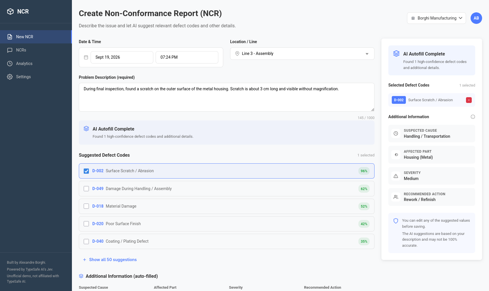

# NCR defect codes AI suggestion demo with Jev



This demo app shows how [TypeSafe AI's Jev model](https://docs.typesafe.ai) can
be used to assign defect codes to a Non-Conformance Report from a short
description written by an operator. This is not a full-fledged app, it is meant
to illustrate how Jev could be used in an industrial setting.

https://github.com/user-attachments/assets/77f81435-ac5b-4d1f-a985-cd974718ff98

## What is Jev?

From [TypeSafe AI's documentation](https://docs.typesafe.ai/introduction):

> Jev is TypeSafe’s flagship model and the first System One model. Send state
> and typed questions; get structured answers your code can use directly.

- _System One model_: a model designed to make fast, structured decisions.
- _Send state and typed questions_: to use the model, give it some data and a
  set of questions to answer (Yes/No, Choice or Score).
- _Get structured answers_: the model returns probabilities for each question
  you asked, allowing the rest of the code to act on them.

It uses general knowledge from its training as well as the context you give it
to answer questions as precisely as possible, also giving you a confidence score
that lets you choose when to trust it.

## How is it used in this demo?

When the user changes the NCR description, the model is called with:

- The state: the NCR description
- The set of questions: a yes or no for each [defect code](./defect_codes.json)

It returns a list of probabilities for each defect code. The suggestions are
sorted by confidence, and the ones that hit a threshold are automatically
checked. The operator still has the choice of removing or adding defect codes.

## Running the code

To run this project, you'll need a TypeSafe API key:

```sh
 TYPESAFE_API_KEY=<your_api_key> cargo run
```

This runs the application on http://127.0.0.1:3000. You _can_ run the app
without setting an API key, but the AI analysis feature will show an error.

## Architecture

The project is built in Rust with Leptos and Axum used together to make a
server-side-rendered application. I used the [Leptos
start-axum](https://github.com/leptos-rs/start-axum) template to start out.

If you're interested in seeing how Jev is used in this application, check out
[src/ncr.rs](./src/ncr.rs).

If you're interested in seeing how the TypeSafe API is called, check out
[src/typesafe.rs](./src/typesafe.rs). TypeSafe has only released SDKs in Python
and JavaScript as of this writing, so I asked GLM-5.3 to generate this
single-file client library from the [API docs](https://docs.typesafe.ai/api). I
didn't look into it very much, but it seems to have done a good job.

## State of the project

This is a simple demo vibe-coded over an afternoon. The code is clearly not
production-grade and the only working feature is the AI defect code suggestion.

The other features displayed in the UI are there to show how this could be
integrated into a larger solution. I would like to implement some of them,
especially the "additional information" panel, showing how we could extract more
information from the same description.

I would also like to come back to this project to do some benchmarking. I'd
like to measure request time and cost, and compare those to a small LLM doing
the same task.

